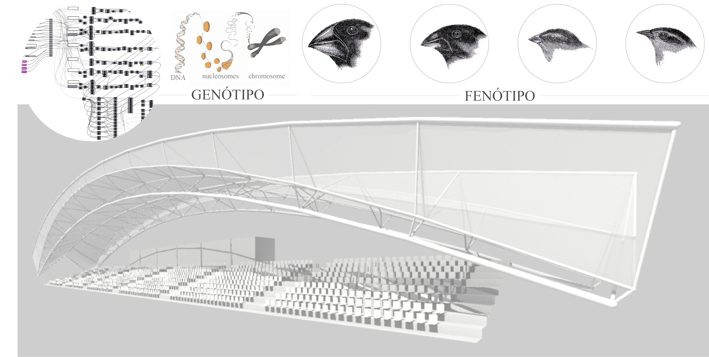

# generative_design_mecom
Generative design in the design development of metallic constructions

### About

Repository of documents, experiments, codes and thesis carried out during the Master's Degree in Metallic Construction of the Department of Civil Engineering of the School of Mines of the Federal University of Ouro Preto, Brazil, as an integral part of the requirements to obtain the title of Master in Construction Metallic.

#### Abstrat

The architectural design is composed of innumerable variables, some of them contradictory, that need to be negotiated constantly. The genetic algorithms represent a technique that contribute to the solution of this type of problem, potentializing the search for better results. For this, it is enough that these are incorporated into the generative design system. The present work describes the construction of a system that combines parametric modeling strategies and genetic algorithms to optimize the total weight of a roof in metallic structure and of its surface as a potential area of photovoltaic energy generation. By means of a reformulation of the evolutionary Darwinian process, a systematization of a project process that allowed the architect to act in the parametrization of the problems, going beyond the mere formal proposition of solutions, in favor of the exploration of a greater variety of projective possibilities of what would be possible using traditional design methods. Thus, the objectives of this research are to evaluate the potential of the use of genetic algorithms as an auxiliary tool integrated to generative design as a design method. The review of the theoretical and practical content of the architecture approached the design practice in which the architect gives up the control of the specific definition of the solution to reach this greater variety of projects. As object of study, we tried to apply the studied process in an architectural design of metallic construction and its energetic potential. As a result, the project stands out as a practice in which the architect and the project dialogue in a flow of information that precedes the project itself, guided by common objectives. The experiments show that the loss of control in the final formulation of a response occurred through the mathematical modeling of the problem and the automatic search of solutions through heuristics. It also highlights a transdisciplinary approach that articulates theory and practice within thinking capable of intertwining specialties and overcoming frontiers in the production of knowledge.

**Key-words:** Generative design, Genetic algorithms, Structural optimization, Environmental optimization, Metallic construction.

### Theoretical reference

1. project as a question - [Caio Adorno Vassão](https://www.blucher.com.br/livro/detalhes/metadesign-620);

2. design and control - [Gaudí](https://en.wikipedia.org/wiki/Antoni_Gaud%C3%AD), [Otto](https://en.wikipedia.org/wiki/Frei_Otto) and [Spuybroek](https://www.nox-art-architecture.com/)

3. design and nature - [Nagy](https://medium.com/generative-design/learning-from-nature-fe5b7290e3de), [Yang](https://www.researchgate.net/publication/235979455_Nature-Inspired_Metaheuristic_Algorithms), [Shiffman](https://natureofcode.com/)

4. design of the design - [Nagy](https://medium.com/generative-design/designing-measures-2c66a71b2ff3)

### Tools

1. [rhinoceros](https://www.rhino3d.com/);

    - [grasshopper 3D](https://www.grasshopper3d.com/page/download-1);
    
      - [karamba 3D](https://www.karamba3d.com/);
        
      - [ladybug](https://www.ladybug.tools/);
      
2. [discover](https://github.com/danilnagy/discover_legacy).

### Strategy

1. construction of the design space;

2. development of measures to assess structural and environmental performance;

3. the application of evolutionary algorithms to search the design space and find high performance projects.

### Implementation, experiments and applying the generative algorithm - the evolutionary solver [Discover](https://github.com/danilnagy/discover_legacy)

### Analysis of results

### Suggestions for future work

The main suggestions for future work are the following suggestions:

1. The methodological development of this work through practical workshops as a reflection on the method adopted, in which it could be tested and discussed with students and professionals, in order to gauge how it would be received by the designers.

2. A deepening of the questions about who defines what is the problem, or what goes into that definition. This issue is important because when a problem is poorly formulated, the project does not solve the problem situation;

3. A greater opening of the design process. In addition to the other agents involved in the design (design partners), the project as a question also opens space to incorporate future users into the process. One of the ways would be to provide this system, more and more, of repertoires that direct it to the metadesign;

4. Finally, to approach, discuss and test this method adopting non-monetary criteria and parameters for choosing the optimal project. This would be an interesting challenge, since this work only adopted criteria (weight of the structure and energy generation potential) as objectives of the optimization procedures tested.

### Appendix

Click [here](https://github.com/renatogcruz/generative_design/blob/master/appendx.py).

### Works derived from this research

Nov, 2018 [Generative design in the design development of metallic constructions](http://www.proceedings.blucher.com.br/article-details/29707). Published in the XXII International Congress of the Ibero-American Society of Digital Graphics.
